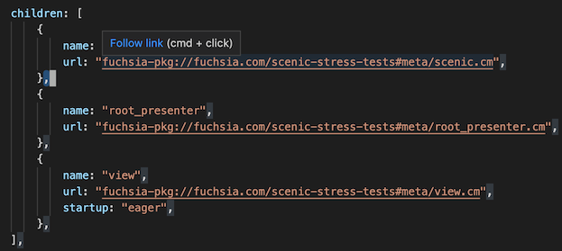

# FuchsiAware - Fuchsia OS Source Tree Browsing Assistance

This extension currently converts fuchsia comonent URLs (beginning with the
`fuchsia-pkg` scheme), in any file, to links that open the component's manifest
source (either `.cml` or `.cmx`).

## Extension Settings

There are currently no settings specific to this extension.

## Release Notes

See the [CHANGELOG](CHANGELOG.md)
