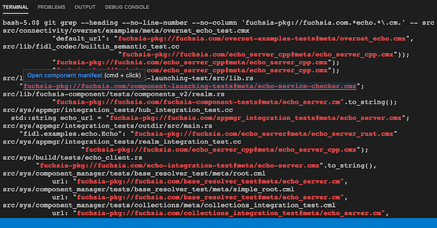
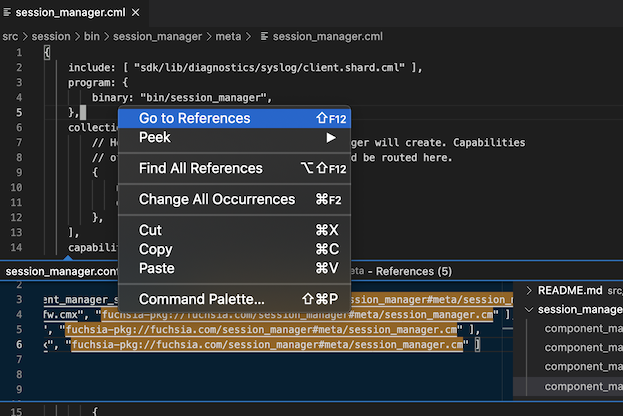
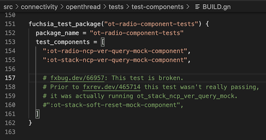

# FuchsiAware
## Fuchsia Source Tree Browsing Assistance

This extension provides additional support to developers working with the source code for the
open source [Fuchsia](https://fuchsia.dev) operating system.

The extension recognizes Fuchsia-specific artifacts in the Fuchsia Git-based source repository
(also known as `fuchsia.git`), and adds features to help navigate them, such as:

* Links from fuchsia component URLs (beginning with the `fuchsia-pkg` scheme), in any file, to the
  component's "manifest" source file (either `.cml` or `.cmx`).

&emsp;&emsp;&emsp;

* Links from fuchsia component URLs (beginning with the `fuchsia-pkg` scheme) in terminal output.
  component's "manifest" source file (either `.cml` or `.cmx`).

&emsp;&emsp;&emsp;

* References back from the manifest to any known source with a `fuchsia-pkg` component URL to the
  manifest's component. Right-click anywhere in the manifest source (in the VS Code editor), and
  select one of the menu options "Go to References" or "Find References".

&emsp;&emsp;&emsp;

* Activates links to prefixed Fuchsia revision and bug IDs; for example:
  - `fxrev.dev/[revision ID]` (and legacy `fxr/[revision ID]`) link to `https://fxrev.dev/[revision ID]`
  - `fxbug.dev/[bug ID]` (and legacy `fxb/[bug ID]`) link to `https://fxbug.dev/[revision ID]`

&emsp;&emsp;&emsp;

## Minimum Requirements and Implementation Details

* You can run the `git` command.
* Your VS Code workspace has exactly one workspace folder that is the root of your cloned `fuchsia`
  repo. (This can be overridden in VS Code "Settings".)
* You ran `fx set ...` (or `fx use ...`) to set the current build directory, and generate _Ninja_
  build dependencies.

The extension reads build commands from the `toolchain.ninja` file in your build directory to
determine the package and component names assocated with each manifest (to establish links from
matching component URLs), and uses the `git grep` command to find references from any text document
in the `fuchsia.git` repo to a known component URL.

Note that a component URL is linked only if its manifest is included in the current `fx set ...`
build configuration.

## Release Notes

See the [CHANGELOG](CHANGELOG.md)
