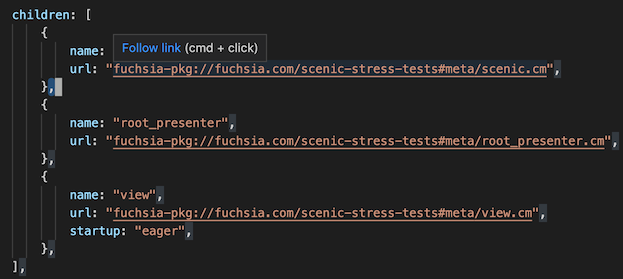
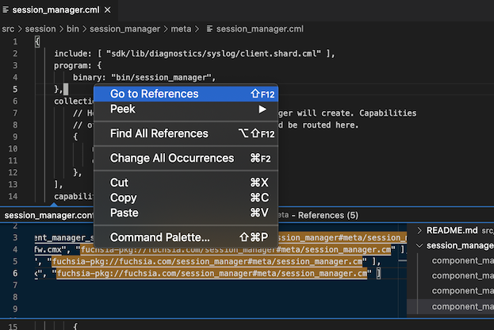

# FuchsiAware
## Fuchsia Source Tree Browsing Assistance

This extension recognizes Fuchsia-specific artifacts in the Fuchsia Git-based source repository
(also known as `fuchsia.git`) and adds links and references to help navigate them.

* Converts fuchsia component URLs (beginning with the `fuchsia-pkg` scheme), in any file, to links
  that open the component's manifest source (either `.cml` or `.cmx`).

* Supports the inverse action by finding references to an open manifest, via it's component URL.
  Right-click a file and select menu option "Go to References" or "Find References".

## Minimum Requirements and Implementation Details

* You can run the `git` command.
* Your VS Code workspace has exactly one workspace folder that is the root of your cloned `fuchsia`
  repo. (This can be overridden in VS Code "Settings".)
* You ran `fx set ...` (or `fx use ...`) to set the current build directory, and generate _Ninja_
  build dependencies.

The extension reads build commands from the `toolchain.ninja` file in your build directory to
determine the package and component names assocated with each manifest (to establish links from
matching component URLs), and uses the `git grep` command to find references from any text document
in the `fuchsia.git` repo to a known component URL.

Note that a component URL is linked only if its manifest is included in the current `fx set ...`
build configuration.

## Release Notes

See the [CHANGELOG](CHANGELOG.md)
